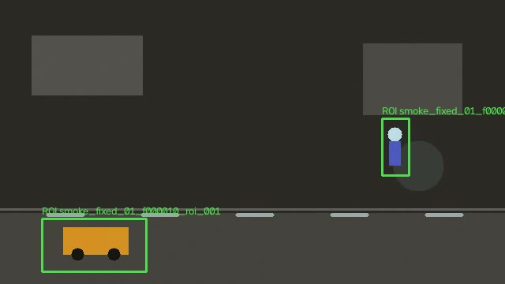
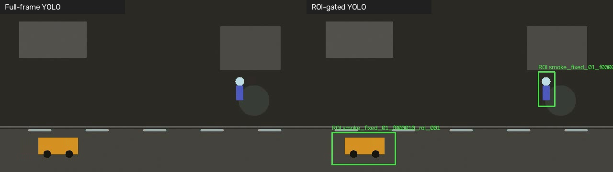

# Smoke Test Visualization Result

## 목적

Task 8 visualization pipeline이 실제 이미지 산출물을 생성하는지 확인했다.

이 결과는 synthetic smoke video 기반의 pipeline 동작 확인용이다. YOLO detection 품질 또는 Phase 1 성능 판단용 결과가 아니다.

## 실행 입력

- Dataset config: `configs/dataset.smoke.yaml`
- Gate config: `configs/npx_gate.smoke.yaml`
- YOLO config: `configs/yolo.yaml`
- Visualization output root: `outputs/visualizations/smoke`
- Frame limit: `60`
- Render limit: `20`

## 실행 산출물

시각화 이미지:

- `outputs/visualizations/smoke/roi_overlay/`: 20 images
- `outputs/visualizations/smoke/comparison/`: 20 images
- `outputs/visualizations/smoke/failures/`: 0 images

입력으로 사용한 중간 산출물:

- `outputs/roi_metadata/smoke_rule_roi.jsonl`: 118 ROI records
- `outputs/roi_metadata/smoke_gate_decisions.jsonl`: 60 frame records
- `outputs/detections/smoke_full_frame.jsonl`: 0 detections
- `outputs/detections/smoke_roi_yolo.jsonl`: 1 detection

## 대표 이미지

### ROI Overlay

### Full-frame vs ROI-gated Comparison

### Failure Cases

이번 smoke run에서는 full-frame YOLO reference detection 기준 missed 후보가 없어 failure image가 생성되지 않았다.

## 확인 내용

- ROI overlay 이미지가 생성됐다.
- comparison 이미지가 생성됐다.
- ROI box가 smoke video의 moving object 주변에 표시됐다.
- failure case 디렉터리는 생성됐고 missed reference 후보는 없었다.

## 해석

이번 smoke video는 synthetic shape 기반이라 YOLO가 실제 객체로 거의 인식하지 못했다.

따라서 이 결과는 다음을 확인하는 smoke test로만 사용한다.

- visualization CLI 실행 가능 여부
- image output directory 생성 여부
- ROI box 렌더링 여부
- comparison panel 렌더링 여부
- failure case 저장 경로 동작 여부

실제 ROI 품질, recall, workload reduction 판단은 VIRAT Ground, OD-VIRAT Tiny, 또는 internal fixed-camera CCTV sample로 수행해야 한다.
